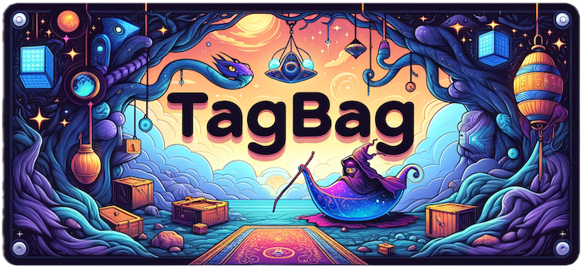

<p align="center">
    
</p>

_This README was created with the assistance of ChatGPT_

Introducing **TAGBAG**, a powerful tool designed to bundle multiple container
images into a single, efficient `tgz` file. TAGBAG streamlines your image
management by eliminating redundant blobs, ensuring that each image is unique
and optimized for storage.

## How to Use TAGBAG

### Pulling Images into a Single Archive

Easily gather multiple images and bundle them into a single `images.tgz`
archive:

```
$ tagbag pull                           \
        -i alpine:latest                \
        -i myrepo/myimage:latest        \
        -d images.tgz
```

TAGBAG intelligently analyzes the layers of the images during this process,
ensuring that duplicate data is minimized and only unique layers are stored.

For authentication, you have two options:
1. Use `docker login` to authenticate with your registry, or
2. Create an authentication file (`auth.json`):

```json
{
    "auths": {
        "https://index.docker.io/v1/": {
            "auth": "bXl1c2VyOm15cGFzc3dvcmQ="
        }
    }
}
```

To use the authentication file, run the following:

```
$ tagbag pull                           \
        --authfile auth.json            \
        -i alpine:latest                \
        -i myrepo/myimage:latest        \
        -d images.tgz
```

### Pushing Images to a New Registry

To push the images back to a new destination, use the following command:

```
$ tagbag push                           \
        --authfile auth.json            \
        -s images.tgz                   \
        --destination docker.io/myaccount
```

In this example, the `alpine:latest` image will be pushed to
`docker.io/myaccount/alpine:latest`. All images in the `tgz` archive,
regardless of their original source, will be uploaded to the specified
repository.

### Viewing Differences Between Two Bundles

You can easily compare the differences between two versions of a `tgz` bundle.
First, ensure both versions are stored locally, then run the following command
to generate a diff:

```
$ tagbag diff                            \
        --source v1.0.0.tgz              \
        --target v2.0.0.tgz              \
        -d overlay.tgz
```

This will create an overlay that highlights the changes between the two
versions. To apply the overlay to an existing `tgz` file, use the following
command:

```
$ tagbag push                            \
        --source v1.0.0.tgz              \
        --overlay overlay.tgz            \
        -d docker.io/myaccount
```

This will apply the overlay (`overlay.tgz`) on top of the `v1.0.0.tgz` bundle,
essentially updating it to the v2.0.0 version. The updated bundle will then be
pushed to the specified registry.
